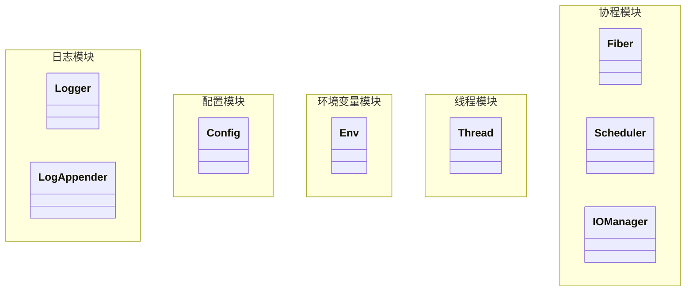
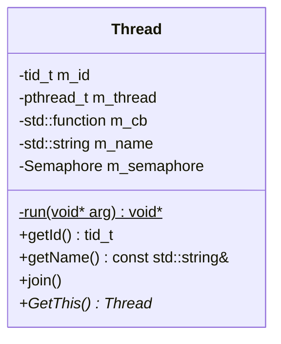

# 服务器剖析

## 项目依赖

### 开发环境

> - Ubuntu 20.04
> - boost
> - yaml-cpp
> - openssl
> - Apache ab
> - doxygen
> - CMake

#### VS-Code好用插件

> - Doxygen Documentation Generator

### 项目路径

```shell
├── CMakeLists.txt      // cmake的定义文件 
├── bin                 // 二进制
├── build               // 中间文件路径
├── cmake               // cmake函数文件夹
├── grit                // 源代码路径
│   ├── config_module       // 配置模块
│   └── log_module          // 日志模块
├── lib                 // 库的输出路径
└── tests               // 测试代码
```

**工欲善其事, 必先利其器**




## 基础模块

### 日志模块

#### 概述

> 用于格式化输出程序日志，方便从日志中定位程序运行过程中出现的问题。这里的日志除了日志内容本身之外，还应该包括文件名/行号，时间戳，线程/协程号，模块名称，日志级别等额外信息，甚至在打印致命的日志时，还应该附加程序的栈回溯信息，以便于分析和排查问题。


### 环境变量模块

### 配置模块

## 高并发模块

### 线程模块

#### 线程类(pthread)封装




#### 互斥量封装

> - `std::atomic_flag`: CAS原子锁
> - `pthread_spinlock_t`: 自旋锁
> - `pthread_rwlock_t`: 读写锁
> - `pthread_mutex_t`: 互斥锁
> - `sem_t`: 信号量

### 协程模块

#### 协程概念

##### 什么是协程?

我的理解，协程是一种**看上去花里胡哨使用上也花里胡哨的函数** ，何出此言，可以看成**可中断的函数**。

可以在执行过程中暂停，并且在需要的时候恢复执行

相较于普通函数**从头到尾的执行**(普通函数从入口进入，遇到作用域结束)，协程可以根据需求在执行过程中主动暂停(yield)，并且在需要的时候恢复执行(resume). 线程执行调度任务的效率就更高，可以避免一些不必要的阻塞，提高当前程序对于CPU的使用效率。

##### 协程的主要思想

**控制流的主动让出和恢复。**

##### 协程的作用

1. 并发和并行

	协程允许程序在同一个线程内执行多个任务，实现并发效果，而不需要创建多个线程或进程。这样可以减少线程切换和资源开销，提高程序性能和效率。

2. 异步编程

	使用协程可以编写异步代码，实现非阻塞的IO操作，提高程序在IO密集型任务中的性能。

3. 状态保存

	协程在执行过程中可以暂停并保存其状态，便于后续恢复执行。这对于一些需要断点续传或回滚操作的场景非常有用。

4. 简化复杂性

	在某些情况下，使用协程可以简化复杂的并发编程问题，使代码更易读、维护和调试。
	
5. **解耦**

	使用协程将IO多路复用的事件循环与具体业务逻辑解耦

	```
	| [业务逻辑]
	| [框架层]      -- 封装事件循环 包装函数
	| [IO多路复用]  -- epoll
	| [协程池]      -- 方便协程管理 
	| [协程]        -- 协程数据结构 核心功能
	```

##### 为什么要使用协程

1. **轻量级：** 协程是轻量级的，创建和销毁的开销较小，相比线程更省资源。
2. **无需锁：** 协程通常在单线程内运行，避免了多线程之间共享数据的复杂性和需要使用锁的问题，减少了出现竞态条件（Race Condition）的可能性。
3. **高效：** 协程的切换由程序自身控制，不需要像线程切换那样的内核态参与，执行效率较高。
4. **简化并发编程：** 使用协程可以避免一些传统并发编程中的问题，例如死锁、资源竞争等。

##### 协程的优缺点

- 优点： 如上所说(demo: 单进程单线程IO多路复用)
- 缺点:
	- 不能利用多核心：协程一般运行在单线程中，无法充分利用多核处理器的优势。
	- **需要显式切换：协程需要显式地在代码中进行切换，如果切换不当，可能导致程序出现逻辑错误**。(项目中出现过，展开讲一讲)
	- 无法进行长时间计算：由于协程在一个线程内执行，如果协程中有长时间的计算操作，会导致其他协程无法执行。

##### 协程与进程和线程的区别

1. **调度方式**

	- 进程是操作系统分配资源的最小单位，进程切换由操作系统进行调度

	- 线程是最小的执行单位，线程切换由操作系统进行调度，但比进程切换开销小很多(

		1. 因为线程切换只需要保存当前线程栈和寄存器，同一个进程内的全局资源在多线程之间共享

		2. 上下文切换速度快，因为线程共享进程的地址空间，上下文切换主要涉及寄存器和线程栈，而不需要切换页表等底层数据结构

		3. 线程同步主要通过共享内存和同步原语(锁，条件变量)，而进程同步需要更复杂的IPC(管道，消息队列，共享内存)

			)

	- 协程的上下文切换由程序自身控制，对内核不可见，切换开销最小，可以在一个线程内执行多个协程任务(并发而不是并行，多个协程共享线程的时间片)

2. **资源占有**：

	- 进程之间相互独立，每个进程有自己独立的用户空间内存空间(32位操作系统虚拟内存0-3G，内核空间进程间共享)
	- 线程共享进程的内存空间，每个线程有自己独立的线程栈(位于进程虚拟用户空间的栈区)
	- 协程共享线程的内存空间

3. 通信方式

	- 进程间： IPC
	- 线程间:  使用共享的进程资源(例如全局变量，但是要考虑线程安全问题)

	**Question：**

	> Q: 单进程内部的多线程环境为什么要考虑线程安全问题，难道不是使用进程的时间片来轮转吗
	>
	> A: 在一个单核处理器系统中，同一时刻只能有一个线程在运行，即多个线程是按照时间片轮转的方式在切换执行的。这是由操作系统的调度器负责控制的。
	>
	> 然而，在多核处理器系统或者支持超线程技术的处理器中，可以同时运行多个线程，即每个核心可以同时执行一个线程。这意味着在同一个进程内的多个线程可以同时运行并发执行。
	>
	> 如果多个线程同时对共享资源进行读写操作，而没有进行适当的同步和互斥处理，就会导致数据不一致或竞态条件等问题。
	
	- 协程间: 直接通过函数调用的方式进行通信

##### 使用协程时的常犯错误(注意事项)

1. **忘记切换：** 在协程中，必须显式地进行切换，否则可能会导致某个协程长时间占用执行，阻塞其他协程的执行。
2. **频繁切换：** 过度切换协程会导致性能下降，应该在适当的时机进行切换，避免切换开销过大。
3. **共享数据问题：** 多个协程访问共享数据时可能会出现竞态条件，需要注意数据同步和互斥。
4. **协程死锁：** 在协程中出现循环调用或相互等待的情况可能导致协程死锁，需要小心设计避免。
5. **长时间计算：** 在协程中避免执行长时间的计算操作，应该适时切换，否则会阻塞其他协程。
6. 非对称协程模型子协程不能resume另一个子协程

##### 协程是否可以优化

#### 如何实现协程?

> 1. C++ 20
> 2. Linux ucontext库

**使用后者**

> Q: 为什么要使用后者？
>
> A: 

##### 基于ucontext_t实现非对称协程

##### 对称模型和非对称模型

非对称协程是跟一个特定的的调用者绑定的，协程在让出CPU时，只能让回给原调用者。

具体表现出来的操作为， 程序控制权转移给被调协程使用的`resume`操作，而被调协程让出CPU时使用`yield`操作。

caller和callee关系是确定的不可更改的，非对称协程只能返回给最初调用它的协程。


对称协程一般而言只有一个操作`yield`, 

###### ucontext原语

ucontext_t 结构体如下所示:

```cpp
typedef struct ucontext_t { // 上下文结构体
    // 当前上下文结束后，下一个激活的上下文对象的指针，只在当前上下文是由makecontext创建时有效
    struct ucontext_t *uc_link;
    // 当前上下文的信号屏蔽掩码
    sigset_t          uc_sigmask;
    // 当前上下文使用的栈内存空间，只在当前上下文是由makecontext创建时有效
    stack_t           uc_stack;
    // 平台相关的上下文具体内容，包含寄存器的值
    mcontext_t        uc_mcontext;
    ...
} ucontext_t;
```

使用到的方法:

```cpp
int getcontext(ucontext_t *ucp); // 获取当前的上下文
int setcontext(const ucontext_t *ucp); // 恢复ucp指向的上下文，这个函数不会返回，而是会跳转到ucp上下文对应的函数中执行，相当于变相调用了函数
/* 修改由getcontext获取到的上下文指针ucp，将其与一个函数func进行绑定，支持指定func运行时的参数，
在调用makecontext之前，必须手动给ucp分配一段内存空间，存储在ucp->uc_stack中，这段内存空间将作为func函数运行时的栈空间，
同时也可以指定ucp->uc_link，表示函数运行结束后恢复uc_link指向的上下文，
如果不赋值uc_link，那func函数结束时必须调用setcontext或swapcontext以重新指定一个有效的上下文，否则程序就跑飞了
makecontext执行完后，ucp就与函数func绑定了，调用setcontext或swapcontext激活ucp时，func就会被运行 */
void makecontext(ucontext_t *ucp, void (*func)(), int argc, ...);
/* 恢复ucp指向的上下文，同时将当前的上下文存储到oucp中，
和setcontext一样，swapcontext也不会返回，而是会跳转到ucp上下文对应的函数中执行，相当于调用了函数
swapcontext是sylar非对称协程实现的关键，线程主协程和子协程用这个接口进行上下文切换*/
int swapcontext(ucontext_t *oucp, const ucontext_t *ucp);
```

###### 协程原语

```cpp
/**
 * @brief 将当前协程切到到执行状态
 * @details 当前协程和正在运行的协程进行交换，前者状态变为RUNNING，后者状态变为READY
 */
void Fiber::resume() {
    SYLAR_ASSERT(m_state != TERM && m_state != RUNNING);
    SetThis(this);
    m_state = RUNNING;

    // 如果协程参与调度器调度，那么应该和调度器的主协程进行swap，而不是线程主协程
    if (m_runInScheduler) {
        if (swapcontext(&(Scheduler::GetMainFiber()->m_ctx), &m_ctx)) {
            SYLAR_ASSERT2(false, "swapcontext");
        }
    } else {
        if (swapcontext(&(t_thread_fiber->m_ctx), &m_ctx)) {
            SYLAR_ASSERT2(false, "swapcontext");
        }
    }
}
/**
 * @brief 当前协程让出执行权
 * @details 当前协程与上次resume时退到后台的协程进行交换，前者状态变为READY，后者状态变为RUNNING
 */
void Fiber::yield() {
    /// 协程运行完之后会自动yield一次，用于回到主协程，此时状态已为结束状态
    SYLAR_ASSERT(m_state == RUNNING || m_state == TERM);
    SetThis(t_thread_fiber.get());
    if (m_state != TERM) {
        m_state = READY;
    }

    // 如果协程参与调度器调度，那么应该和调度器的主协程进行swap，而不是线程主协程
    if (m_runInScheduler) {
        if (swapcontext(&m_ctx, &(Scheduler::GetMainFiber()->m_ctx))) {
            SYLAR_ASSERT2(false, "swapcontext");
        }
    } else {
        if (swapcontext(&m_ctx, &(t_thread_fiber->m_ctx))) {
            SYLAR_ASSERT2(false, "swapcontext");
        }
    }
}
```

###### 协程的五个要素

1. 协程id: 类比线程id, 进程id, 是区分不同协程的标志

2. 协程栈: 类比线程栈, 存储协程执行期间的局部变量，函数调用信息以及其他临时数据

3. 协程状态: 类比进程五状态模型，线程五状态模型, 协程4状态模型来控制协程的**让出**和**恢复**

	> Q: 为什么协程是四状态模型?
	>
	> A: **无需锁：** 协程通常在单线程内运行，避免了多线程之间共享数据的复杂性和需要使用锁的问题，减少了出现竞态条件（Race Condition）的可能性。**实现了Hook功能的协程没有阻塞态**。

4. 协程上下文，ucontext_t 保存寄存器等信息

5. 协程入口函数，类比线程入口函数

###### 实现细节

0. 继承自`enable_shared_from_this`

	> Q: 为什么要继承`enable_shared_from_this`
	>
	> A: 

1. 使用两个**全局静态原子变量**, 用于生成协程id和协程数量。

	```cpp
	/// 全局静态变量，用于生成协程id
	static std::atomic<uint64_t> s_fiber_id{0};
	/// 全局静态变量，用于统计当前的协程数
	static std::atomic<uint64_t> s_fiber_count{0};
	```

	> Q: 什么是原子类型?
	>
	> A: 原子操作是一系列不可被 CPU 上下文交换的机器指令， 是一种无锁技术的多线程并发编程方式. 在多核CPU下，当某个CPU核心开始运行原子操作时，会先暂停其他CPU内核对内存的操作。由于原子操作是通过指令完成的，它的性能高于锁和消息传递。使用原子类型开发者不需要处理加锁和释放锁的问题，但无锁不意味着无需等待，由于内部使用CAS循环，当大量冲突发生，该等待的还是得等待。但总比加锁好。

	> CAS 全称是 Compare and swap, 它通过一条指令读取指定的内存地址，然后判断其中的值是否等于给定的前置值，如果相等，则将其修改为新的值

2. 使用两个**线程局部变量**, 用于记录当前线程正在运行的协程和当前线程的主协程。以达到非对称协程`yield`和`resume`的操作。

	```cpp
	/// 线程局部变量，当前线程正在运行的协程
	static thread_local Fiber *t_fiber = nullptr; // 使用裸指针是因为t_fiber只是记录当前运行的协程, 不参与生命周期控制
	/// 线程局部变量，当前线程的主协程，切换到这个协程，就相当于切换到了主线程中运行，智能指针形式
	static thread_local Fiber::ptr t_thread_fiber = nullptr;
	```

	> Q: 什么是线程局部变量?
	>
	> A: 线程局部变量与全局变量类似，不同之处在于声明的线程局部变量在每个线程都独有一份，而全局变量是全部线程共享一份。

	> Q: 为什么要使用这两个线程局部变量?
	>
	> A: TODO

3. 构造函数

	- 无参构造: 初始化当前线程的协程功能，构造线程主协程对象，以及对t_fiber和t_thread_fiber进行赋值。这个构造函数被定义成私有方法，不允许在类外部调用，只能通过GetThis()方法，在返回当前正在运行的协程时，如果发现当前线程的主协程未被初始化，那就用不带参的构造函数初始化线程主协程。因为GetThis()兼具初始化主协程的功能，在使用协程之前必须显式调用一次GetThis()。
	- 有参构造: 构造子协程，初始化子协程的ucontext_t上下文和栈空间，要求必须传入协程的入口函数，以及可选的协程栈大小。

4. `SetThis`和`GetThis`成员方法

5. `yield`和`resume`成员方法

6. `MainFunc`协程入口函数

### 协程调度模块

> 所谓协程调度，其实就是创建一批的协程对象，然后再创建一个调度协程，通过调度协程把这些协程对象一个一个消化掉（协程可以在被调度时继续向调度器添加新的调度任务)

#### 为什么要有协程调度

在前面的协程模块中，对于每个协程，都需要用户手动调用协程的resume方法将协程运行起来，然后等协程运行结束并返回，再运行下一个协程。这种运行协程的方式其实是用户自己在挑选协程执行，相当于用户在充当调度器，显然不够灵活.

#### 为什么要使用多线程参与调度?

一个线程同一时刻只能运行一个协程，所以，作为协程调度器，势必要用到多线程来提高调度的效率，因为有多个线程就意味着有多个协程可以同时执行，这显然是要好过单线程的。

既然多线程可以提高协程调度的效率，那么，能不能把调度器所在的线程（称为caller线程）也加入进来作为调度线程呢？比如典型地，在main函数中定义的调度器，能不能把main函数所在的线程也用来执行调度任务呢？答案是肯定的，在实现相同调度能力的情况下（指能够同时调度的协程数量），线程数越小，线程切换的开销也就越小，效率就更高一些，所以，调度器所在的线程，也应该支持用来执行调度任务。甚至，调度器完全可以不创建新的线程，而只使用caller线程来进行协程调度，比如只使用main函数所在的线程来进行协程调度。

#### 调度器设计

- 任务队列
- 调度线程池

开始调度后，线程池从任务队列中按顺序取任务执行, 当全部任务执行完毕之后，线程池停止调度， 等待新的任务加入进来。添加新仍无后，应该有某种机制通知线程池有新的任务进来了，线程池重新开始调度。

停止调度时， 等待各调度线程退出，调度器停止工作。

#### 调度器功能

- 支持多线程
- 支持caller线程参与调度
- 支持添加函数或协程作为调度对象
- 支持将函数或协程绑定到一个具体的线程上执行

#### 调度器实现细节

##### start方法启动调度

1. 创建调度线程池(线程数量由初始化时的线程数和use_caller确定)
2. 调度线程从任务队列中取任务执行
3. 注意: 如果初始化时指定线程数为1且use_caller为true, start()方法将什么也不做, 因为不需要创建新线程用于调度, 并且由于没有创建新的调度线程, 只能由caller线程的调度协程来负责调度协程

##### run方法调度协程

1. 调度协程负责从调度器的任务队列中取任务执行(取出的任务即子协程)
2. 调度协程和子协程的切换模型为非对称模型(子协程执行完后返回调度协程, 由调度协程重新从任务队列中取新的协程并执行)
3. 如果任务队列空了, 那么调度协程会切换到一个idle协程, 这个idle协程什么也不做, 等到有新任务进来时, idle协程才会退出并回到调度协程, 重新开始调度
	**在非caller线程中, 调度协程是调度线程的主协程;**
	**但在caller线程中, 调度协程并不是caller线程的主协程, 而是相当于caller线程的子协程**

##### 调度器的停止

- 分为两种情况讨论:
- 1. use_caller == false
		没有使用caller线程进行调度, 只需要简单等待各调度线程的调度协程退出就行了
- 1. use_caller == true
		表示caller线程也参与到调度中,

### IO协程调度模块

> 继承协程调度器，封装了Epoll，支持为socket fd注册读写事件回调函数

> 解决了调度器在idle状态下忙等待导致CPU占用率高的问题。使用一对管道fd来tickle调度协程，当调度器空闲时，idle协程通过epoll_wait阻塞在管道上的读描述符，等管道的可读事件。添加新任务时，tickle方法写管道，idle协程检测到管道可读之后，退出，重新开始执行调度。


### 定时器模块

### hook模块

## 网络库模块

### Address模块

### Socket模块

### ByteArray类

### Stream模块

### TcpServer类

### HTTP模块

## 守护进程

## 解耦合

### 1. 使用协程将IO多路复用的事件循环与具体业务逻辑解耦


## 写在后面

### Reactor模型 与Proactor模型 

> **Reactor模型用于同步I/O**
>
> **Proactor模型用于异步I/O**

Reactor模型的三个重要组件的实现:

- 多路复用器, 使用epoll来实现
- 事件分发器, 封装scheduler类来接受epoll返回的就绪事件，执行相应的处理
- 事件处理器, 封装Fiber协程库，将所有事件的处理(各种可执行对象)封装成协程

# Epoll + 线程池

## 为什么使用epoll？

我在了解IO多路复用模型的时候了解到有select， poll，epoll三种模型，select的优势就是跨平台，然后poll和select没有什么本质上的区别，只是将传入传出的event事件分离了，但他们都是在用户态将文件描述符fd添加到监听集合中，每次调用都需要拷贝到内核层。这产生了很多不必要的拷贝开销，且监听的fd是有限制的，32位操作系统默认是1024个，然后监听是基于轮询的监听，效率比较低。而epoll是直接在系统内核维护了一棵监听树来监听文件描述符， 省去了很多拷贝开销，且epoll同时具有LT和ET两种触发模式，在多线程情况下更为高效，遍历方式也相比轮询会更加高效，当事件就绪会自动触发epoll回调函数，内核将就绪文件描述符放到就绪列表中，epoll_wait仅需查看就绪列表是否有文件描述符就绪。所以相较于select跨平台的优点，它的缺点过于明显。且我了解到服务器一般是部署到Linux系统上，也了解到很多开源框架是用epoll来开启事件监听的。对于并发量不大，且活跃度较高更适合用传统单线程同步IO。像select和poll，对于高并发低活跃这种场景更适合用epoll来提升性能、

## 为什么不用异步IO?

linux本身提供的asio⽬前只⽀持⽂件fd，不⽀持⽹络fd，但是可以⽤⼀个线程去模拟异步io的操作


## 为什么要用线程池？

1. 提高线程的重用性，避免单客户端绑定一个线程，线程资源是有限的。这样处理不能处理大量并发的场景。且这样会产生大量的创建和销毁开销，使用线程池的话可以让一个线程处理多个客户端业务，只需要将业务的回调函数传递给业务线程就行。
2. 为了解耦，这是使用多线程的目的。避免单个业务处理时间过长导致事件循环无法继续

线程池是一个生产者消费者模型

## 实现细节

线程安全相关属性:

- 互斥量
- 条件变量

任务队列相关属性:

- 任务队列类型（链表实现环形队列)
- 队列首，尾，最大值，当前元素

线程相关属性:

- 最大线程数
- 最小线程数
- 当前存活线程数量
- 忙碌线程数量
- 线程开关

1. `thread_pool_t` 结构体：定义了线程池的相关属性，包括线程的最大数量、最小数量、当前存活的线程数量、工作队列等。
2. `thread_pool_create` 函数：用于创建一个线程池，初始化线程池中的线程等属性。
3. `thread_pool_destroy` 函数：用于销毁线程池，释放相关资源。
4. `thread_pool_add_task` 函数：向线程池的任务队列添加任务。
5. `customer` 函数：线程池中的工作线程函数，用于执行具体的任务。
6. `manager` 函数：线程池管理线程函数，用于线程池的动态管理（调整线程数量等）。
7. `busines_accept` 函数：用于接受客户端连接的函数。
8. `busines_response` 函数：用于处理客户端请求的函数。
9. `server_net_init` 函数：用于初始化服务器网络相关的设置。
10. `server_epoll_create` 函数：用于创建一个Epoll实例。
11. `server_epoll_listen` 函数：用于监听Epoll事件并进行处理。

# 基于Epoll+线程池之上，

每当一个客户端请求建立连接，都需要分配一个线程来处理连接请求，


